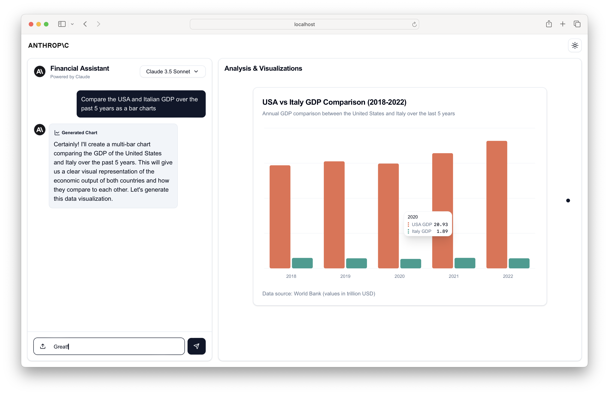
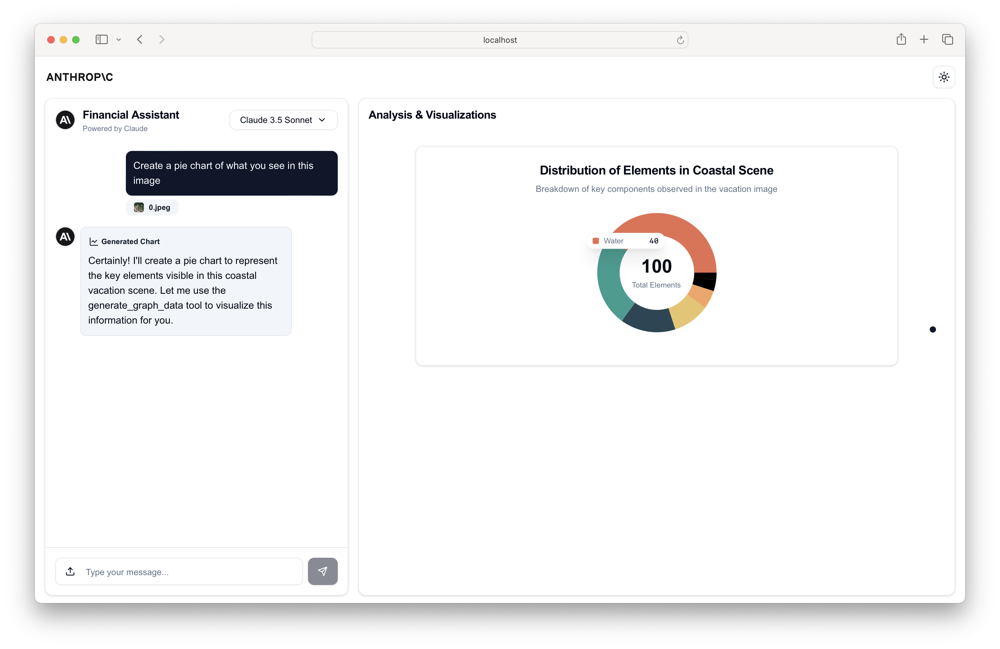

# Claude ServiceNow Data Analyst



A sophisticated Next.js application that combines Claude's capabilities with interactive data visualization to analyze ServiceNow data exports via chat.

## Features

- **Intelligent Data Analysis**: Powered by Claude (Using Claude 3 Haiku, Claude 3.5 Sonnet & Claude 4.5 Sonnet)
- **Multi-Format File Upload Support**:
  - ServiceNow CSV exports (incident, change, asset data)
  - Excel files (.xlsx - export as CSV from ServiceNow)
  - Text/Code files (.txt, .md, .html, .py, .csv, etc)
  - PDF reports from ServiceNow
  - Images and screenshots
- **Interactive Data Visualization**: Based on ServiceNow data patterns, Claude can generate the following charts:
  - Line Charts (Incident trends, ticket volume over time)
  - Bar Charts (Priority distribution, status comparisons)
  - Multi-Bar Charts (Team performance, multi-metric analysis)
  - Area Charts (Backlog trends, cumulative volumes)
  - Stacked Area Charts (Multi-category breakdowns over time)
  - Pie Charts (Assignment distribution, category allocation)

## Getting Started

### Prerequisites

- Node.js 18+ installed
- Claude API key (For Claude integration)

### Installation

1. Clone the repository:
```bash
git clone https://github.com/anthropics/anthropic-quickstarts.git
cd anthropic-quickstarts/financial-data-analyst
```

2. Install dependencies:
```bash
npm install
```

3. Create a `.env.local` file in the root directory:
```env
ANTHROPIC_API_KEY=your_api_key_here
```

4. Run the development server:
```bash
npm run dev
```

Open [http://localhost:3000](http://localhost:3000) with your browser to see the result.

## Technology Stack

- **Frontend**:
  - Next.js 14
  - React
  - TailwindCSS
  - Shadcn/ui Components
  - Recharts (For data visualization)
  - PDF.js (For PDF processing)

- **Backend**:
  - Next.js API Routes
  - Edge Runtime
  - Anthropic SDK

## Usage Examples

The assistant can help with various ServiceNow data analysis tasks:

1. **Incident Analysis**:
   - Upload incident exports (CSV, Excel)
   - Analyze ticket volume trends over time
   - Identify patterns by priority, category, or assignment group
   - Track resolution times and SLA compliance

2. **Change Management**:
   - Visualize change request patterns
   - Compare success rates by type or risk level
   - Analyze approval workflows
   - Track change volume by timeline

3. **Asset & CMDB Analysis**:
   - Review asset distribution by department or location
   - Track asset lifecycle and status changes
   - Analyze hardware/software inventory trends
   - Generate allocation reports

4. **Performance Metrics**:
   - Team workload distribution
   - First-call resolution rates
   - Mean time to resolution (MTTR)
   - Backlog trends and forecasting

5. **Service Catalog Analytics**:
   - Request fulfillment patterns
   - Popular service items
   - Approval cycle analysis
   - Department-wise request distribution

## Common ServiceNow Export Formats

The tool works best with data exported from ServiceNow in these formats:

- **CSV Exports**: Standard table exports with column headers
- **Excel Files**: Export as CSV for best compatibility
- **PDF Reports**: ServiceNow-generated reports with text content
- **Screenshots**: For quick visual analysis or dashboard reviews

### How to Export from ServiceNow:
1. Navigate to your desired table (Incidents, Changes, Assets, etc.)
2. Apply any filters you need
3. Right-click on the list header → Export → CSV or Excel
4. Upload the exported file to this tool



## Deploy to ServiceNow

This app can be embedded directly into ServiceNow Service Portal as a native widget.

**Quick Start:**
1. Build widget: `cd servicenow-widget && npm install && npm run build`
2. Follow deployment guide: `servicenow-widget/DEPLOY.md`

**What you get:**
- Native ServiceNow integration (no external hosting)
- Embedded in Service Portal
- Uses ServiceNow authentication
- API calls stay within your instance

**Deployment time:** ~30 minutes

